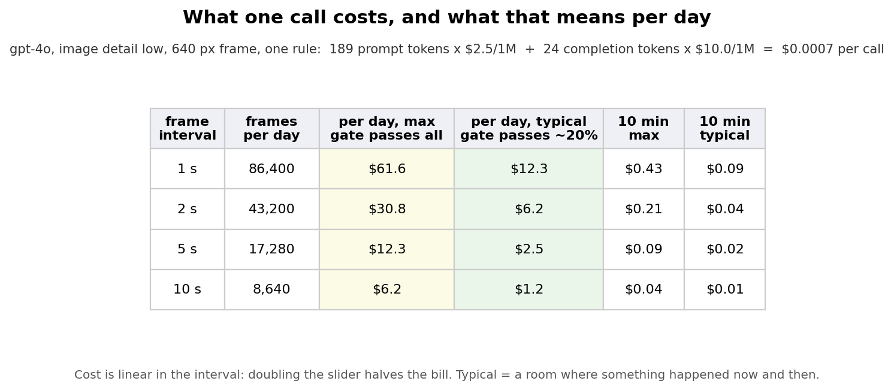

# Watcher

**Point a camera at anything. Say what should happen. Get told the moment it does.**

Watcher turns any phone or laptop camera into a watchdog that understands plain English.
No zones to draw, no objects to pick from a list, no training. You type
*"the cat jumps onto the table"* and walk away. When it happens, you get a photo of the
moment on your phone.

**No special hardware.** Take the old phone from the drawer, open the page, prop it up
against a mug, and forget about it. Telegram will tell you when something happens.
Grok's vision API does the looking; Render hosts it; the phone just has to have a camera.

> Built at the Grok Bot Serbia Hackathon, Belgrade, 12 September 2026.


Many frames in, few model calls, one alert per event. The gate in the middle is where most
frames die; everything to its right runs only when the scene actually changed.

## What it feels like

1. **Open the page, allow the camera.**
2. **Type a rule.** *"Someone opens the door."* *"The kettle starts boiling."*
   *"The baby stands up in the crib."* Speak it instead if you'd rather not type.
3. **Press Watch.** Add up to five rules, change them mid-session, nothing restarts.
4. **Scan the QR code.** Now the alert lands in Telegram with the proof frame attached.
5. **Walk away.** When the door opens, your phone buzzes with the exact frame that shows it.

That's the whole product. No account, no install, nothing stored. Close the tab and
the session is gone.

## See it


The page after the cat showed up. Two rules run at once, the first one just fired, the
event sits on the right with its snapshot, and the counters show what eight seconds of
watching cost.

<p align="center">
  
</p>

The same session on the phone. The dashboard lists every rule with its current state and
the model's last words about it. When the cat arrives, the photo lands with the rule that
fired, what the model saw, and buttons to snapshot, browse, pause or go back. This one is
a rendering of the bot's real messages and buttons, not a screenshot from a phone.

## Why it's different

**Any old phone is the camera.** A security camera costs money, needs an app, a hub,
a subscription. Watcher needs a browser. The phone you replaced two years ago is now a
smart camera. Leave it on the windowsill, walk away, wait for the buzz.

**Several things at once.** Up to five rules watch the same camera in one session, and
one model call answers all of them. *"The cat is on the table"* and *"someone opens the
fridge"* and *"the light goes off"* run together. Add or drop rules mid-session from the
page or from Telegram without restarting.

**It understands events, not just objects.** Classic camera alerts fire on "motion" or
"person detected". Watcher fires on a *change* you described: the cat *jumps onto* the
table, not "cat present". You say when; it figures out what state to look for and which
direction the change goes.

**It thinks like a person, not a pixel counter.** A vision model (Grok) looks at the
frame and answers your rule in words. It works on things no motion detector can see:
a light turning on, a pot boiling over, a parcel appearing on the doorstep, a dog getting
on the sofa.

**It doesn't cry wolf.** Every event fires exactly once, at the moment it happens, with
the frame that proves it. No repeat alerts while the cat sits there. It fires again only
when the cat leaves and comes back.

**Tokens only when the scene changes.** Most frames never reach the model. A local
filter compares each frame with the last one that mattered, ignores camera shake and
lighting drift, and only sends frames where something actually changed. A static room
costs nothing for hours. The page shows live what the session has cost in tokens and
dollars.

**Your phone is the remote.** From Telegram you can take a fresh snapshot right now,
add or edit rules, browse recent moments, or pause alerts, all without touching the
laptop that holds the camera.

**Rules in any words.** *"Tell me when the parking spot is free."* *"When my kid leaves
the room."* *"When the printer finishes."* The rule gets rewritten into something a single
frame can answer, and if it doesn't describe a change at all, Watcher says so before
wasting a call.

## Use it for

- **Is the cat on the table?** Point the old phone at the kitchen. *"The cat jumps onto
  the table."* Get the photo evidence and go argue with the cat.
- **Birdwatching out the window.** *"A bird lands on the feeder."* Every visitor gets
  its own snapshot in Telegram, no sitting by the glass.
- **Home security.** *"Someone enters the room."* *"The front door opens."* *"A person
  is at the window."* An old phone on a shelf becomes an alarm that sends you the face.
- **Pets.** The dog on the bed. The hamster out of the cage. The parrot on the curtain.
- **Home.** Parcel at the door. Garage left open. Kettle boiled. Washing machine done.
- **Kids and family.** Baby stood up in the crib. Someone got out of bed. Door opened
  after midnight.
- **Workshops and kitchens.** Pot boiling over. 3D print failed. Coffee ready.
- **Waiting for things.** The parking spot is free. The queue moved. The delivery van
  pulled up. The neighbour's light came on.

If you can say it in a sentence and see it in one frame, Watcher can watch for it.
The only limit is what you think of asking.

## Preprocessing: why a static room costs nothing

Every frame from the browser passes through a gate before anything is sent to Grok. The
gate answers one question: *is there anything in this frame the model hasn't already
seen?* If not, the frame is dropped and costs zero tokens. Three of the four pairs below
are the same kitchen; the gate lets only the cat through.


Left: the **anchor**, the last frame that went to the model. Middle: the new frame.
Right: the residual difference on an 8×8 board after compensation; white outline marks
tiles above the send threshold. Real night-vision frames from `data/`, the nudge and the
dimming are synthetic.

### The pipeline, per frame

Everything below runs in a worker thread in a few milliseconds on a 128×72 thumbnail.

1. **Shrink and blur.** Resize to 128×72 (INTER_AREA), Gaussian blur with σ=2, in
   float32. Sensor noise, JPEG blocks and fine texture vanish; a cat, a person or a parcel
   are still tens of pixels wide.

2. **Align against the anchor.** `cv2.findTransformECC` estimates a pure translation
   between the anchor and the new frame. It is accepted only if correlation ≥ 0.97, the
   shift is ≤ 2 px at thumbnail scale (roughly 1% of the frame), and the shift *improves*
   the match in at least 8 of 16 textured regions spread over at least 3 quadrants.
   A phone that got nudged is cancelled. A large object moving is not mistaken for a
   camera move, because it only helps the match locally.

3. **Fit the lighting to the quiet majority.** Per RGB channel, a gain and offset are
   fitted with three rounds of robust regression: each round keeps the 70% of pixels
   that the current fit explains best. The fit is rejected if gain leaves [0.67, 1.5] or
   offset exceeds 40 levels, or if any quadrant of the frame is less than half "quiet"
   after correction, so a bright object filling a corner cannot redefine the exposure of
   the whole scene. Auto-exposure drift, a cloud, a dimmed lamp: explained away.

4. **Measure what's left in Lab.** Both images go to Lab colour space; the per-pixel
   residual is the max over L, a, b. The residual is averaged over each of 64 tiles
   (16×9 px), counting only pixels that overlap after alignment. The loudest tile is the
   score.

5. **Decide.** Score above 6.6 Lab levels: send the frame now, make it the new anchor.
   Below: drop it. No cooldown, no waiting for a second frame, no hysteresis; the first
   frame that shows a real change goes straight to the model.

The same pair before and after steps 2 and 3:


Two details that matter in practice:

- **Frames during a model call are gated but not sent.** One in-flight request per
  session. If the scene changed while Grok was thinking, the next frame carries it.
- **Quiet frames never move the anchor.** The anchor advances only when a frame is sent,
  so a slow change (dusk, a cat creeping in) accumulates against the same reference until
  it crosses the threshold, instead of hiding in a chain of small steps.

Regenerate the figures with:

```bash
PYTHONPATH=. poetry run python scripts/gate_figures.py
```

`poetry run python -m scripts.benchmark_gate` runs the gate on synthetic shifts,
lighting changes and objects and compares it with the original pixel-diff filter,
without calling any model. Synthetic cases only; real shadows, clipped highlights, big
camera moves and flat scenes may still trigger calls.

## Run it yourself

You need Python 3.10, Poetry, and an xAI API key. A Telegram bot token is optional but
that's where the fun is.

```bash
make install                 # poetry install
cp .env.example .env         # fill in XAI_API_KEYS, optionally TELEGRAM_BOT_TOKEN
make dev                     # http://localhost:8000
```

Browsers only expose the camera on `https://` or `localhost`, so for a phone on the same
Wi-Fi you'll want a tunnel or a deploy. `render.yaml` deploys the whole thing to Render
on push to `master`; secrets live in the Render dashboard.

To create the Telegram bot: talk to [@BotFather](https://t.me/BotFather), `/newbot`,
copy the token into `.env`. Full details in [src/server/telegram/README.md](src/server/telegram/README.md).

```bash
make test                    # pytest
make format                  # black + isort
make lint                    # black --check, isort --check, mypy
```

## Under the hood

One FastAPI process, one static page, no database. Hosted on Render: `render.yaml`
deploys on every push to `master`, Render terminates TLS, which browsers require before
they hand over the camera.

- **Browser** grabs a frame every 1 to 10 seconds (your slider), JPEG-encodes it, posts it.
  Model results come back over Server-Sent Events.
- **Gate** (`src/server/cv/gate.py`) decides whether the frame is worth a model call.
  See [Preprocessing: why a static room costs nothing](#preprocessing-why-a-static-room-costs-nothing).
- **Perception** (`src/server/cv/perception.py`) is Grok's vision API through the
  OpenAI-compatible Chat Completions endpoint. One frame and all your rules go in a single
  prompt; back comes a true/false plus a few words of evidence per rule. Your rule is
  first normalised by a text-only call into a state a single frame can answer, plus the
  direction of change you're waiting for. Several API keys can be listed; it fails over
  between them.
- **Tracker** (`src/server/tracker.py`) remembers the last confirmed answer per rule and
  fires only on the edge: rising for "appears", falling for "leaves". Same answer twice
  in a row is silence, so one moment is one alert.
- **Notifier** logs the event, and if Telegram is configured, sends the proof frame as a
  photo. The bot binds to a browser, not a session, so one QR scan covers everything
  that browser watches later.

Sessions live in memory and expire after 30 seconds of silence. Settings are environment
variables with defaults; see `.env.example` and `src/config.py`.

## What it costs

The counter on the page is not an estimate: every Grok response carries the exact
amount billed for that call (`usage.cost_in_usd_ticks`, 1 tick = 1e-10 USD), and the
session just adds them up. Cached prompt tokens and image tokens are already priced in.

One call is one frame plus all your rules, about 520 prompt tokens with a single rule:
240 for the image, the rest for the prompt text, which xAI mostly serves from cache.
That is $0.0004 to $0.0006 on `grok-4.20-0309-non-reasoning`. What you pay per day is
that number times how many frames reach the model, and two things decide that: the
slider and the gate.



Max is the ceiling: the scene changes every frame and the gate lets everything through.
Avg is a measured session: a room where something happened now and then, the gate
dropped four frames out of five. Cost is linear in the interval, so doubling the slider
halves the bill. A tab in the background sends nothing.

## Notebooks

The gate and the perception prompt were shaped in `notebooks/`. To run them in VS Code:
`poetry install`, install the Python and Jupyter extensions, open an `.ipynb`, and pick
`.venv/bin/python` as the kernel. `make notebook` starts Jupyter Lab on `:8889` for the
`jupyter` MCP.
